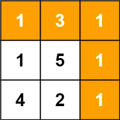

# 64. Minimum Path Sum


Given a `m x n` `grid` filled with non-negative numbers, find a path from top left to bottom right, which minimizes the sum of all numbers along its path.

**Note**: You can only move either down or right at any point in time.

 

**Example 1:**



>**Input**: grid = [[1,3,1],[1,5,1],[4,2,1]]  
**Output**: 7  
**Explanation**: Because the path 1 → 3 → 1 → 1 → 1 minimizes the sum.


**Example 2:**

>**Input**: grid = [[1,2,3],[4,5,6]]  
**Output**: 12
 

**Constraints**:

* `m == grid.length`
* `n == grid[i].length`
* `1 <= m, n <= 200`
* `0 <= grid[i][j] <= 200`


## 2D-DP-Top Down: Recursion + Memoization

        
1. **State**
   * `dp[row][col]` stores minimum sum to reach this point

2. **Recursion Relation**
   * pick the smaller one
   * `dp[row][col] = min(dp[row][col-1], dp[row-1][col])`
3. **Base Case**
   * row, col stays in bounds

```python
class Solution:
    def minPathSum(self, grid: List[List[int]]) -> int:


        
        rows, cols = len(grid), len(grid[0])
        # stores minumum sums
        memo = [[-1]*cols for _ in range(rows)]

        # fill values for the upmost and leftmost lanes
        memo[0][0] = grid[0][0]
        for c in range(1, cols):
            memo[0][c] = grid[0][c] + memo[0][c-1]
        
        for r in range(1, rows):
            memo[r][0] = grid[r][0] + memo[r-1][0]

        def dp(row, col):
            # out of bounds, return infinite which will never be picked
            if row == 0 or col == 0:
                return memo[row][col]
                
            # recursion relation into memory
            if memo[row][col] == -1:
                memo[row][col] = min(dp(row, col-1), dp(row-1, col)) + grid[row][col]
                
            return memo[row][col]
        
        dp(rows-1, cols-1)
        return memo[rows-1][cols-1]
```


## 2D-DP-Bottom Up: Iteration + 2D Array

1. **State**
    * `dp[row][col]` the minimum sum to reach this point
2. **Recursion Relation**
    * current minimum sum = smallest previous sum + current cost
    * `dp[row][col] = min(dp[row][col-1], dp[row-1][col]) + grid[row][col]`
3. **Base Case**
   * stay in bounds, we fill values into upmost and leftmost lanes, start from [1][1]

```python
class Solution:
    def minPathSum(self, grid: List[List[int]]) -> int:
        rows, cols = len(grid), len(grid[0])
        dp = [[-1]*cols for _ in range(rows)]
        # base case
        dp[0][0] = grid[0][0]
        # fill values into upmost and leftmost lanes
        for c in range(1, cols):
            dp[0][c] = grid[0][c] + dp[0][c-1]
        
        for r in range(1, rows):
            dp[r][0] = grid[r][0] + dp[r-1][0]
        
        # start from [1][1]
        for row in range(1, rows):
            for col in range(1, cols):
                dp[row][col] = min(dp[row][col-1], dp[row-1][col]) + grid[row][col]
        # bottom right elements
        return dp[rows-1][cols-1]
```
