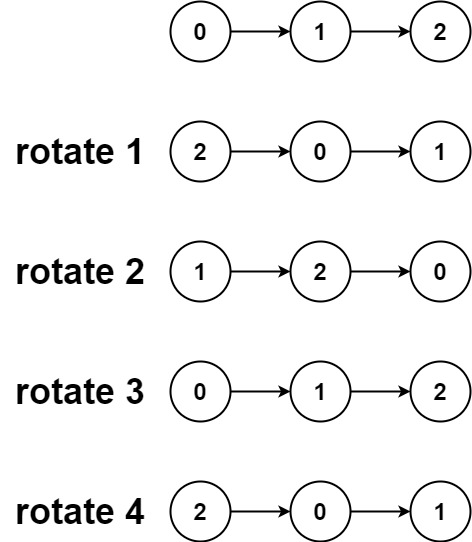

# 61. Rotate List

Given the head of a linked list, rotate the list to the right by k places.


**Example 1:**

```
Input: head = [1,2,3,4,5], k = 2
Output: [4,5,1,2,3]
```
**Example 2:**

```
Input: head = [0,1,2], k = 4
Output: [2,0,1]
```
 

**Constraints:**

* The number of nodes in the list is in the range `[0, 500]`.
* `-100 <= Node.val <= 100`
* `0 <= k <= 2 * 109`

## Solution

**Rotation** with **Circular** linked list.

```python
# Definition for singly-linked list.
# class ListNode:
#     def __init__(self, val=0, next=None):
#         self.val = val
#         self.next = next
class Solution:
    def rotateRight(self, head: Optional[ListNode], k: int) -> Optional[ListNode]:
        # KEY: Rotation can be done with [circular] linked list
        if not head: return
        # find the length of list and last node
        lastNode = head
        length = 1
        while lastNode.next:
            lastNode = lastNode.next
            length += 1
        print(length)
        # steps rotation actually move
        # k = length, then steps = 0, nothing changed.
        # k != length, like 2 % 5 = 2, 2 nodes are rotated.
        k = k % length
        # create a circular linked list
        # |->1->2->3->4->5-|
        # |<--<--<--<--<--<|
        lastNode.next = head
        # we need to move length - k steps to reach the new rotation end
        # k=2, move 5-2=3 steps to reach Node(3)
        for _ in range(length - k):
            lastNode = lastNode.next
        # |->1->2->3 cut here 4->5-|
        # |<--<--<--<--<--<--<----<|
        newHead = lastNode.next
        lastNode.next = None    
        return newHead
```
