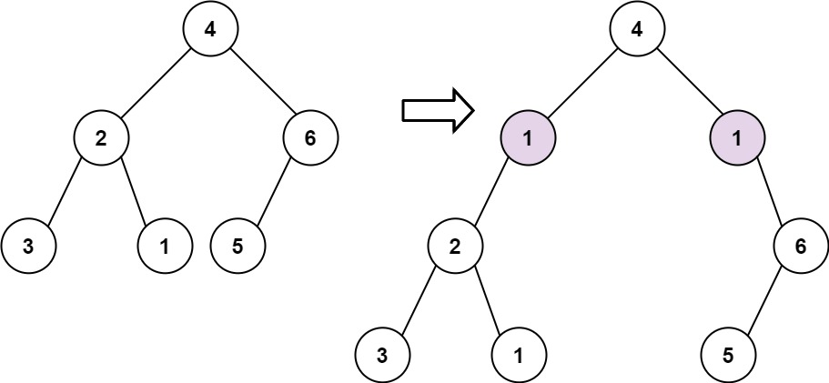
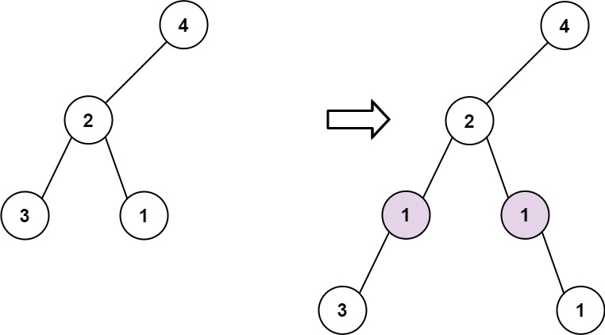

# 623. Add One Row to Tree

Given the `root` of a binary tree and two integers `val` and `depth`, add a row of nodes with value `val` at the given depth `depth`.

Note that the `root` node is at depth `1`.

The adding rule is:

Given the integer `depth`, for each not null tree node `cur` at the depth `depth - 1`, create two tree nodes with value `val` as `cur`'s left subtree root and right subtree root.
`cur`'s original left subtree should be the left subtree of the new left subtree root.
`cur`'s original right subtree should be the right subtree of the new right subtree root.
If `depth == 1` that means there is no depth `depth - 1` at all, then create a tree node with value `val` as the new root of the whole original tree, and the original tree is the new root's left subtree.
 

**Example 1:**


>**Input:** root = [4,2,6,3,1,5], val = 1, depth = 2  
**Output:** [4,1,1,2,null,null,6,3,1,5]


**Example 2:**


>**Input:** root = [4,2,null,3,1], val = 1, depth = 3  
**Output:** [4,2,null,1,1,3,null,null,1]
 

**Constraints:**

* The number of nodes in the tree is in the range `[1, 104]`.
* The depth of the tree is in the range `[1, 104]`.
* `-100 <= Node.val <= 100`
* `-105 <= val <= 105`
* `1 <= depth <= the depth of tree + 1`

## Solution
```python
# Definition for a binary tree node.
# class TreeNode:
#     def __init__(self, val=0, left=None, right=None):
#         self.val = val
#         self.left = left
#         self.right = right
class Solution:
    def addOneRow(self, root: Optional[TreeNode], val: int, depth: int) -> Optional[TreeNode]:
        """BFS, level traversal, extreme case handle"""
        if depth == 1:
            cur = root
            root = TreeNode(val=val, left=cur)

        dq = collections.deque([root])
        level = 1
        while dq and level <= depth:
            # reach the level we should insert new nodes
            if level == depth - 1:
                for _ in range(len(dq)):
                    cur = dq.popleft()
                    # save the children of current node
                    left = cur.left
                    right = cur.right
                    cur.left = TreeNode(val=val, left=left)
                    cur.right = TreeNode(val=val, right=right)
            # we keep traversing
            else:
                for _ in range(len(dq)):
                    cur = dq.popleft()
                    if cur.left:
                        dq.append(cur.left)
                    if cur.right:
                        dq.append(cur.right)
            # update current level
            level += 1
        return root
```
