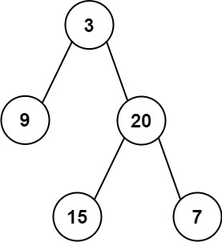
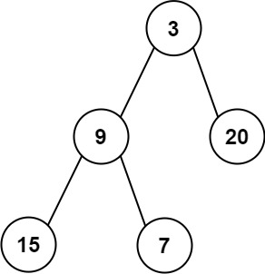

# 637. Average of Levels in Binary Tree

Given the `root` of a binary tree, return the average value of the nodes on each level in the form of an array. Answers within `10^-5` of the actual answer will be accepted.
 

**Example 1:**


Input: root = [3,9,20,null,null,15,7]
Output: [3.00000,14.50000,11.00000]
Explanation: The average value of nodes on level 0 is 3, on level 1 is 14.5, and on level 2 is 11.
Hence return [3, 14.5, 11].
**Example 2:**



Input: root = [3,9,20,15,7]
Output: [3.00000,14.50000,11.00000]
 

**Constraints:**

* `The number of nodes in the tree is in the range [1, 104].`
* `-231 <= Node.val <= 231 - 1`

## Solution

```python

# Definition for a binary tree node.
# class TreeNode:
#     def __init__(self, val=0, left=None, right=None):
#         self.val = val
#         self.left = left
#         self.right = right
class Solution:
    def averageOfLevels(self, root: Optional[TreeNode]) -> List[float]:
        # BFS, level traverse
        dq = collections.deque([root])
        res = list()
        while dq:
            level_sum = 0
            level_len = len(dq)
            # pop out all nodes on current level
            for _ in range(level_len):
                cur = dq.popleft()
                level_sum += cur.val
                if cur.left:
                    dq.append(cur.left)
                if cur.right:
                    dq.append(cur.right)
            # after traverse current level, calculate avg
            res.append(round(level_sum / level_len, 5))
        return res
```
