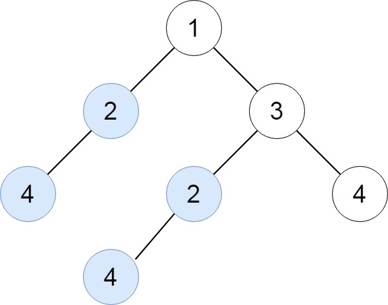
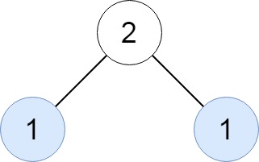
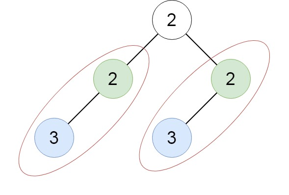

# 652. Find Duplicate Subtrees


Given the `root` of a binary tree, return all **duplicate subtrees**.

For each kind of duplicate subtrees, you only need to return the root node of any **one** of them.

Two trees are **duplicate** if they have the **same structure** with the **same node values**.


**Example 1:**




>**Input**: root = [1,2,3,4,null,2,4,null,null,4]  
**Output**: [[2,4],[4]]  


**Example 2:**




>**Input**: root = [2,1,1]  
**Output**: [[1]]  


**Example 3:**



>**Input**: root = [2,2,2,3,null,3,null]  
**Output**: [[2,3],[3]] 
 

**Constraints:**

* The number of the nodes in the tree will be in the range `[1, 5000]`
* `-200 <= Node.val <= 200`


## DFS + Binary Tree Serialization + Hash Table
O(n^2)

```python
# Definition for a binary tree node.
# class TreeNode:
#     def __init__(self, val=0, left=None, right=None):
#         self.val = val
#         self.left = left
#         self.right = right
class Solution:
    def findDuplicateSubtrees(self, root: Optional[TreeNode]) -> List[Optional[TreeNode]]:
        # DFS + Binary Tree Serialization + Hash Table
        # seen: store all types of Serializations
        seen = {}
        # repeat: store repeatitions
        repeat = set()
        def dfs(root):
            # return empty string for Serialization
            if not root:
                return ""

            # get current root Serialization
            # root(LEFT Serialization)(RIGHT Serialization)
            # 4()()
            # 2(4()())()
            # 4()()      repeat found
            # 2(4()())() repeat found
            # 4()()
            # 3(2(4()())())(4()())
            # 1(2(4()())())(3(2(4()())())(4()()))
            serial =  str(root.val) + "(" + dfs(root.left) + ")" + "(" + dfs(root.right) + ")"
            # check if we've seen this serial before
            if seen.get(serial, None):
                repeat.add(seen[serial])
            # add this serial into seen start by current root
            else:
                seen[serial] = root
            # return current root serial for its parents Serialization
            return serial
        dfs(root)
        return list(repeat)
```


## Triple Variables (X, L, R)
O(n)

```python
# Definition for a binary tree node.
# class TreeNode:
#     def __init__(self, val=0, left=None, right=None):
#         self.val = val
#         self.left = left
#         self.right = right
class Solution:
    def __init__(self):
        # index for new root occurrence in the tree
        self.idx = 0

    def findDuplicateSubtrees(self, root: Optional[TreeNode]) -> List[Optional[TreeNode]]:
        # Triple Variables (X, L, R)
        # {triple: (node, idx)}
        seen = {}
        repeat = set()
        def dfs(root):
            if not root:
                return 0
            # root.val, idx of LEFT node, idx of RIGHT node
            # (4, 0, 0) idx = 1
            # (2, 1, 0) idx = 2
            # (4, 0, 0) repeat found, return repeated node's index 1; idx remain the same
            # (2, 1, 0) repeat found, return repeated node's index 2; idx remain the same
            # (4, 0, 0) repeat found, return repeated node's index 1; idx remain the same
            # (3, 2, 1) idx = 3
            # (1, 2, 3) idx = 4
            tri = (root.val, dfs(root.left), dfs(root.right))
            # repeat found
            if tri in seen:
                (node, index) = seen[tri]
                repeat.add(node)
                # return the repeatition node index for parent's triple
                return index
            # new node, add it to hash table
            else:
                # increase idx for new root occurrence
                self.idx += 1
                seen[tri] = root, self.idx
                # return current node index for parent's triple
                return self.idx
        dfs(root)
        return list(repeat)
```
