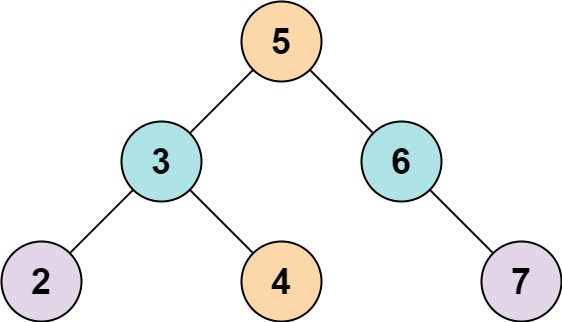
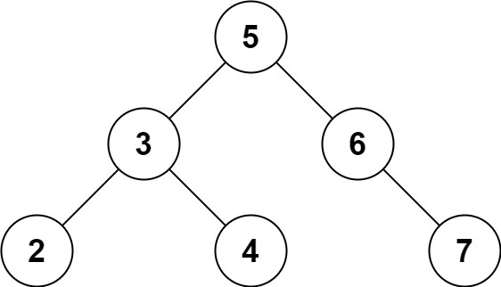

# 653. Two Sum IV - Input is a BST


Given the root of a binary search tree and an integer k, return true if there exist two elements in the BST such that their sum is equal to k, or false otherwise.

**Example 1:**



>**Input:** root = [5,3,6,2,4,null,7], k = 9   
**Output:** true    


**Example 2:**



>**Input:** root = [5,3,6,2,4,null,7], k = 28  
**Output:** false  
 

**Constraints:**

* The number of nodes in the tree is in the range `[1, 104]`.
* `-104 <= Node.val <= 104`
* `root` is guaranteed to be a **valid** binary search tree.
* `-105 <= k <= 105`

## BST + Hash Table(use set to avoid duplicates)
```python
# Definition for a binary tree node.
# class TreeNode:
#     def __init__(self, val=0, left=None, right=None):
#         self.val = val
#         self.left = left
#         self.right = right
class Solution:
    def findTarget(self, root: Optional[TreeNode], k: int) -> bool:
        # BST + Hash Table(use set to avoid duplicates)
        record = set()
        
        def find(node):
            if not node:
                return False
            if node.val in record:
                return True
            # add current deduction into set
            record.add(k - node.val)
            # keep searching for LEFT and RIGHT
            return find(node.left) or find(node.right)
        
        return find(root)
```
