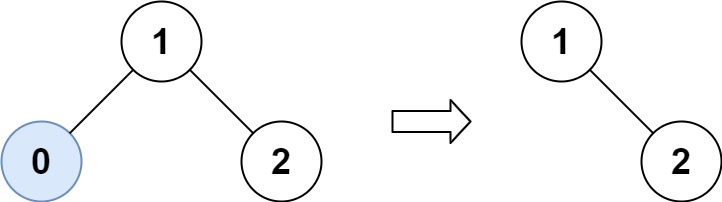
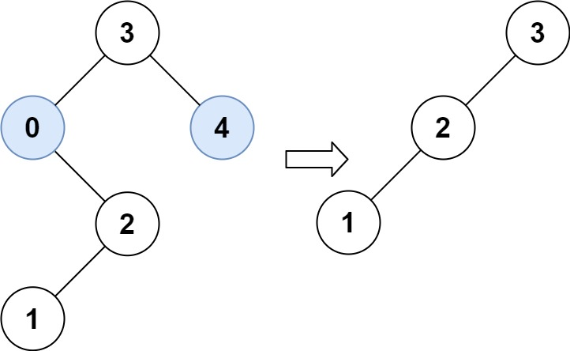

# 669. Trim a Binary Search Tree

Given the `root` of a binary search tree and the lowest and highest boundaries as `low` and `high`, trim the tree so that all its elements lies in `[low, high]`. Trimming the tree should not change the relative structure of the elements that will remain in the tree (i.e., any node's descendant should remain a descendant). It can be proven that there is a **unique answer**.

Return *the root of the trimmed binary search tree.* Note that the root may change depending on the given bounds.

 

**Example 1:**



>Input: root = [1,0,2], low = 1, high = 2  
Output: [1,null,2]  

**Example 2:**



>Input: root = [3,0,4,null,2,null,null,1], low = 1, high = 3  
Output: [3,2,null,1]  
 

**Constraints:**

* The number of nodes in the tree is in the range `[1, 104]`.
* `0 <= Node.val <= 104`
* The value of each node in the tree is unique.
* root is guaranteed to be a valid binary search tree.
* `0 <= low <= high <= 104`

## DFS Recursive(Java)

```java
/**
 * Definition for a binary tree node.
 * public class TreeNode {
 *     int val;
 *     TreeNode left;
 *     TreeNode right;
 *     TreeNode() {}
 *     TreeNode(int val) { this.val = val; }
 *     TreeNode(int val, TreeNode left, TreeNode right) {
 *         this.val = val;
 *         this.left = left;
 *         this.right = right;
 *     }
 * }
 */
class Solution {
    public TreeNode trimBST(TreeNode root, int low, int high) {
        // KEY: if current node < low, all left subtrees are also smaller, same for right side
        if (root == null){
            return null;
        }
        // all left side < low, only check right; already out of bound, no reconnection for current node
        if (root.val < low){
            return trimBST(root.right, low, high);
        }
        // all right side > high, only check left; already out of bound, no reconnection for current node
        else if (root.val > high){
            return trimBST(root.left, low, high);
        }
        // within boundry, check both side, reconnect the trim result from both side
        else{
            root.left = trimBST(root.left, low, high);
            root.right = trimBST(root.right, low, high);
            return root;
        }
    }
}
```

## DFS Recursive(Python)

```python
# Definition for a binary tree node.
# class TreeNode:
#     def __init__(self, val=0, left=None, right=None):
#         self.val = val
#         self.left = left
#         self.right = right
class Solution:
    def trimBST(self, root: Optional[TreeNode], low: int, high: int) -> Optional[TreeNode]:
        # KEY: if current node smaller than low, all left subnodes are smaller than low, same for right side

        def dfs(node):
            if not node:
                return
            # curr node already smaller than low, only need to check right
            if node.val < low:
                # KEY: current node has been dropped
                return dfs(node.right)
            # curr node already bigger than high, only need to check left
            elif node.val > high:
                # KEY: current node has been dropped
                return dfs(node.left)
            # within boundry, check both side
            else:
                node.left = dfs(node.left)
                node.right = dfs(node.right)
                return node
        return dfs(root)
```