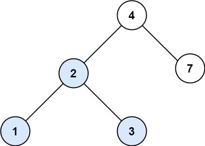
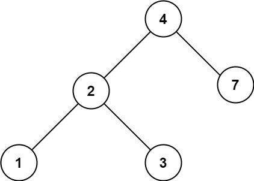

# 700. Searching a Binary Search Tree

You are given the `root` of a binary search tree (BST) and an integer `val`.

Find the node in the BST that the node's value equals `val` and return the subtree rooted with that node. If such a node does not exist, return `null`.


**Example 1:**




**Input**: root = [4,2,7,1,3], val = 2
**Output**: [2,1,3]


**Example 2:**



**Input**: root = [4,2,7,1,3], val = 5
**Output**: []
 

**Constraints:**

* The number of nodes in the tree is in the range `[1, 5000]`.
* `1 <= Node.val <= 107`
* `root` is a binary search tree.
* `1 <= val <= 107`

## Iteration

```python
# Definition for a binary tree node.
# class TreeNode:
#     def __init__(self, val=0, left=None, right=None):
#         self.val = val
#         self.left = left
#         self.right = right
class Solution:
    def searchBST(self, root, val):
        curr = root
        while curr:
            if val < curr.val:
                curr = curr.left
            elif val > curr.val:
                curr = curr.right
            else:
                return curr
```

## Recursion

```python
# Definition for a binary tree node.
# class TreeNode:
#     def __init__(self, val=0, left=None, right=None):
#         self.val = val
#         self.left = left
#         self.right = right
class Solution:
    def searchBST(self, root: Optional[TreeNode], val: int) -> Optional[TreeNode]:
        # DFS, Recursion
        def dfs(root, val):
            if not root:
                return
            # LEFT
            if val < root.val:
               return dfs(root.left, val) 
            # RIGHT
            elif val > root.val:
                return dfs(root.right, val)
            # Target Found
            else:
                return root
        return dfs(root, val)
```
