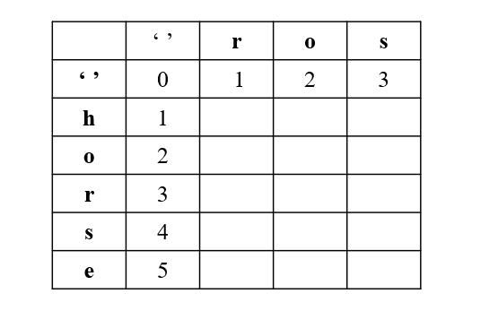

# 72. Edit Distance


Given two strings `word1` and `word2`, return *the minimum number of operations required to convert `word1` to `word2`*.

You have the following three operations permitted on a word:

* Insert a character
* Delete a character
* Replace a character
 

**Example 1:**

>**Input**: word1 = "horse", word2 = "ros"  
**Output**: 3  
**Explanation**:   
horse -> rorse (replace 'h' with 'r')  
rorse -> rose (remove 'r')  
rose -> ros (remove 'e')  


**Example 2:**

>**Input**: word1 = "intention", word2 = "execution"  
**Output**: 5  
**Explanation**:   
intention -> inention (remove 't')  
inention -> enention (replace 'i' with 'e')  
enention -> exention (replace 'n' with 'x')  
exention -> exection (replace 'n' with 'c')  
exection -> execution (insert 'u')  
 

**Constraints:**

* `0 <= word1.length, word2.length <= 500`
* `word1` and `word2` consist of lowercase English letters.


## 2D-DP-Top Down: Recursion + Memoization(2D Array)

1. **States**
   * `dp[i][j]`, operations needed to transfer word1[:i+1] to word2[:j+1]
2. **Recursion Relation**
   * `dp[i][j-1]` operations needed for insert
   * `dp[i-1][j]` operations needed for delete
   * `dp[i-1][j-1]` operations needed for replace
   * 
3. **Base Case**
   * word1 empty, insert len(word2)
   * word2 empty, delete len(word1)

```python
class Solution:
    def minDistance(self, word1: str, word2: str) -> int:
        # word1 row, word2: col
        len1, len2 = len(word1), len(word2)
        # extra row and col for base case empty
        dp = [[0]* (len2+1) for _ in range(len1+1)]
        
        def edit(row, col):
            # Base Cases
            # row < 0: word1 empty, col + 1 insert operations to do
            # col < 0: word2 empty, row + 1 delete operations to do
            if row < 0 or col < 0:    
                return col + 1 + row + 1
                
            # remember to use memo to avoid duplicate calculations
            if dp[row][col]:
                return dp[row][col]

            # Match found, same num of operations as previous step
            if word1[row] == word2[col]:
                dp[row][col] = edit(row-1, col-1)
            # Diff found, find the minimum steps of 3 types operations
            else:
                insert = edit(row, col-1)
                delete = edit(row-1, col)
                replace = edit(row-1, col-1)
                # minimum previous operations + 1 current operation
                dp[row][col] = min(insert, delete, replace) + 1
            return dp[row][col]
        # start from the last index of each word
        return edit(len1-1, len2-1)
```

## 2D-DP-Bottom Up: Iteration + 2D Array

```python
        
        len1, len2 = len(word1), len(word2)
        # base case: one extra row and col for empty word1 or word2
        dp = [[0]*(len2+1)for _ in range(len1+1)]
        # fill values into row 1 and col 1, then start from [1][1]
        #             word2
        # word1    "" r o s  
        # ""       0  1 2 3
        # h        1 
        # o        2
        # r        3
        # s        4
        # e        5
        # row 1, word1 is empty, all insert operations
        for col in range(1, len2+1):
            dp[0][col] = dp[0][col-1] + 1
        # col 1, word2 is empty, all delete operations
        for row in range(1, len1+1):
            dp[row][0] = dp[row-1][0] + 1
        # start from [1][1]
        for row in range(1, len1+1):
            for col in range(1, len2+1):
                # match found, same operations as previous step
                # Be Careful, row, col is for dp matrix
                # for word1 and word2, it should start at index 0, row-1, col-1
                if word1[row-1] == word2[col-1]:
                    dp[row][col] = dp[row-1][col-1]
                # diff found
                else:
                    insert = dp[row][col-1]
                    delete = dp[row-1][col]
                    replace = dp[row-1][col-1]
                    # previous minimum operations + 1 current operation
                    dp[row][col] = min(insert, delete, replace) + 1
        return dp[-1][-1]
```
