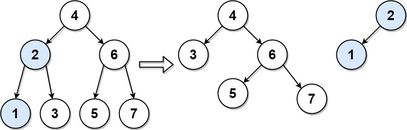

# 776. Split BST

Given the `root` of a binary search tree (BST) and an integer `target`, split the tree into two subtrees where one subtree has nodes that are all smaller or equal to the target value, while the other subtree has all nodes that are greater than the target value. It Is not necessarily the case that the tree contains a node with the value `target`.

Additionally, most of the structure of the original tree should remain. Formally, for any child `c` with parent `p` in the original tree, if they are both in the same subtree after the split, then node `c` should still have the parent `p`.

Return *an array of the two roots of the two subtrees.*

 

**Example 1:**




>**Input**: root = [4,2,6,1,3,5,7], target = 2  
**Output**: [[2,1],[4,3,6,null,null,5,7]]  


**Example 2:**

>**Input**: root = [1], target = 1  
**Output**: [[1],[]]  
 

**Constraints:**

* The number of nodes in the tree is in the range `[1, 50]`.
* `0 <= Node.val, target <= 1000`


## Recursion

KEY: Never dig into details of recursion, will be easily lost, just write it with intuition.

Python
```python
# Definition for a binary tree node.
# class TreeNode:
#     def __init__(self, val=0, left=None, right=None):
#         self.val = val
#         self.left = left
#         self.right = right
class Solution:
    def splitBST(self, root: Optional[TreeNode], target: int) -> List[Optional[TreeNode]]:
        """
        BST Definition
        Direction of Recursion, don't dig into details of recursion, be easily lost
        root.val <= target, splitBST(root.left)
        root.val > target, splitBST(root.right)
        
        result structure [smaller left subtree, larger right subtree]
        result[0] values <= target
        result[1] values > target
        """

        def dfs(root):
            if not root:
                return [None, None]
            if root.val <= target:
                # get sub result from right part [smaller subtree, larger subtree]
                right_result = dfs(root.right)
                # KEY: split the larger BST, reconnect its SMALLER BST
                root.right = right_result[0]
                # current root BST is the SMALLER part
                return [root, right_result[1]]
            else:
                # get sub result from left part [smaller subtree, larger subtree]
                left_result = dfs(root.left)
                # split the smaller BST, reconnect its LARGER BST
                root.left = left_result[1]
                # current root BST is the LARGER part
                return [left_result[0], root]
        return dfs(root)
```

Java

```java
/**
 * Definition for a binary tree node.
 * public class TreeNode {
 *     int val;
 *     TreeNode left;
 *     TreeNode right;
 *     TreeNode() {}
 *     TreeNode(int val) { this.val = val; }
 *     TreeNode(int val, TreeNode left, TreeNode right) {
 *         this.val = val;
 *         this.left = left;
 *         this.right = right;
 *     }
 * }
 */
class Solution {
    // root.val <= target, return right as subtree for reconnection
    // root.val > target, return left as subtree for reconnection
    // result[0] <= target
    // result[1] > target

    public TreeNode[] splitBST(TreeNode root, int target) {
        // for each recursion, we return its result for the parent
        TreeNode[] result = new TreeNode[2]; // default result [null, null]

        if (root == null) {
            return result;
        }

        if (root.val <= target) {
            result[0] = root;   //obviously current root is SMALLER part
            TreeNode[] rightSubResult = splitBST(root.right, target);
            result[1] = rightSubResult[1];   // rightSubResult[1] is the LARGER part for cuurent result
            root.right = rightSubResult[0];  // reconnect sub SMALLER part to current root
        }
        else {
            result[1] = root;   // obviously current root is LARGER part
            TreeNode[] leftSubResult = splitBST(root.left, target);
            result[0] = leftSubResult[0];   // leftSubResult[0] is the SMALLER part for current result
            root.left = leftSubResult[1]; // reconnect LARGER part to current root
        }
        return result;
    }   
}
```