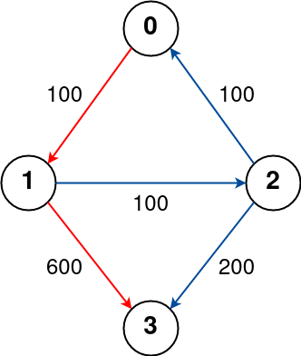
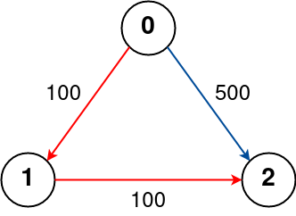
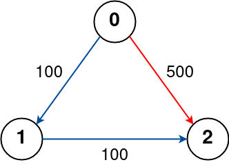

# 787. Cheapest Flights Within K Stops

There are n cities connected by some number of flights. You are given an array flights where flights[i] = [fromi, toi, pricei] indicates that there is a flight from city fromi to city toi with cost pricei.

You are also given three integers src, dst, and k, return the cheapest price from src to dst with at most k stops. If there is no such route, return -1.


**Example 1:**



>Input: n = 4, flights = [[0,1,100],[1,2,100],[2,0,100],[1,3,600],[2,3,200]], src = 0, dst = 3, k = 1  
Output: 700  
Explanation:  
The graph is shown above.  
The optimal path with at most 1 stop from city 0 to 3 is marked in red and has cost 100 + 600 = 700.  
Note that the path through cities [0,1,2,3] is cheaper but is invalid because it uses 2 stops.  


**Example 2:**



>Input: n = 3, flights = [[0,1,100],[1,2,100],[0,2,500]], src = 0, dst = 2, k = 1 
Output: 200  
Explanation:  
The graph is shown above.  
The optimal path with at most 1 stop from city 0 to 2 is marked in red and has cost 100 + 100 = 200.  

**Example 3:**



>Input: n = 3, flights = [[0,1,100],[1,2,100],[0,2,500]], src = 0, dst = 2, k = 0  
Output: 500  
Explanation:  
The graph is shown above.  
The optimal path with no stops from city 0 to 2 is marked in red and has cost 500.  
 

**Constraints:**

* `1 <= n <= 100`
* `0 <= flights.length <= (n * (n - 1) / 2)`
* `flights[i].length == 3`
* `0 <= fromi, toi < n`
* `fromi != toi`
* `1 <= pricei <= 104`
* There will not be any multiple flights between two cities.
* `0 <= src, dst, k < n`
* `src != dst`


```java
class Solution {
    public int findCheapestPrice(int n, int[][] flights, int src, int dst, int k) {
        Map<Integer, List<int[]>> graph = new HashMap<>();
        for (int[] f : flights){
            if (!graph.containsKey(f[0])){
                graph.put(f[0], new ArrayList<>());
            }
            graph.get(f[0]).add(new int[] { f[1], f[2]});  // [dest1, cost1], [dest2, cost2]...
        }
        int[] cost = new int[n];                            // cost from src
        Arrays.fill(cost, Integer.MAX_VALUE);

        Queue<int[]> q = new LinkedList<>();
        q.offer(new int[] {src, 0});
        int stops = 0;

    while (stops <= k && !q.isEmpty()) {
            int sz = q.size();
            // Iterate on current level.
            while (sz-- > 0) {
                int[] temp = q.poll();
                int node = temp[0];
                int distance = temp[1];

                if (!graph.containsKey(node))
                    continue;
                // Loop over neighbors of popped node.
                for (int[] e : graph.get(node)) {
                    int neighbour = e[0];
                    int price = e[1];
                    if (price + distance >= cost[neighbour])
                        continue;
                    cost[neighbour] = price + distance;
                    q.offer(new int[] { neighbour, cost[neighbour] });
                }
            }
            stops++;
        }
        return cost[dst] == Integer.MAX_VALUE ? -1 : cost[dst];
    }
}
```


```python

```