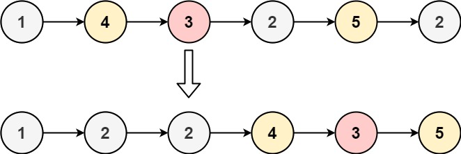

# 86. Partition List

Given the `head` of a linked list and a value `x`, partition it such that all nodes **less than** `x` come before nodes **greater than or equal** to x.

You should **preserve** the original relative order of the nodes in each of the two partitions.


**Replenish Description**:

Basically, it asks us:
Reorder the sequence by the given number x

The **rules** are:

1. Any number that is less than x has to be before x, and maintain the relative order with thoese that are less than x but already before x.
e.g. `[3,4,1,2], target = 4` -> `[3,1,2,4]`, so the order of [3,1,2] is maintained.
2. Any number that is greater than x but already before x will still be before x, but all of them come after those that are less than x and at the same time maintain their relative order.
e.g. `[3,6,5,4,1,2] target = 4` -> `[3,1,2,6,5,4]`
3. Any number that is greater than x and after x will only need to maintain their relative order
e.g. `[3,6,5,4,8,1,7,2] target = 4` -> `[3,1,2,6,5,4,8,7]`


**Example 1:**


Input: head = [1,4,3,2,5,2], x = 3
Output: [1,2,2,4,3,5]
**Example 2:**

Input: head = [2,1], x = 2
Output: [1,2]
 

**Constraints:**

* The number of nodes in the list is in the range `[0, 200]`.
* `-100 <= Node.val <= 100`
* `-200 <= x <= 200`


## Solution

```python
# Definition for singly-linked list.
# class ListNode:
#     def __init__(self, val=0, next=None):
#         self.val = val
#         self.next = next
class Solution:
    def partition(self, head: Optional[ListNode], x: int) -> Optional[ListNode]:
        if not head: return
        """two buckets, left, right, two pointers l, r."""
        left, right = ListNode(), ListNode()
        l, r = left, right
        cur = head
        while cur:
            # save next and cut it to avoid circulation in linked list
            nxt = cur.next
            cur.next = None
            # left part
            if cur.val < x: 
                l.next = cur
                l = l.next
            # cur.val >= x
            else: 
                r.next = cur
                r = r.next
            cur = nxt
        # connect left and right parts
        l.next = right.next
        return left.next
```
