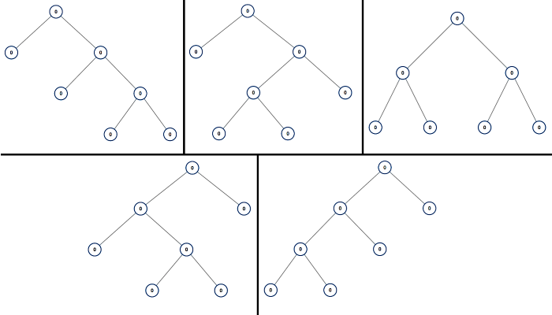

# 894. All Possible Full Binary Trees

Given an integer `n`, return *a list of all possible **full binary trees** with `n` nodes.* Each node of each tree in the answer must have `Node.val == 0`.

Each element of the answer is the root node of one possible tree. You may return the final list of trees in **any order**.

A **full binary tree** is a binary tree where each node has exactly 0 or 2 children.

 

**Example 1:**



>**Input**: n = 7  
**Output**: [[0,0,0,null,null,0,0,null,null,0,0],[0,0,0,null,null,0,0,0,0],[0,0,0,0,0,0,0],[0,0,0,0,0,null,null,null,null,0,0],[0,0,0,0,0,null,null,0,0]]  


**Example 2:**

>**Input**: n = 3  
**Output**: [[0,0,0]]  
 

**Constraints:**

* `1 <= n <= 20`


## DP Top Down: Recursion + Memoization
```python
# Definition for a binary tree node.
# class TreeNode:
#     def __init__(self, val=0, left=None, right=None):
#         self.val = val
#         self.left = left
#         self.right = right
class Solution:
    def allPossibleFBT(self, n: int) -> List[Optional[TreeNode]]:
        """
        enumerate all possibilities to find recursive relations
        # n=7 nodes total
        # n-1=6 nodes left
        # left 1 right n-1-1=5
        # left 3 right n-1-3=3
        # left 5 right n-1-5=1
        """
        # store result for each to avoid duplicate calculation
        memo = {}
        # for each n, there might be a list of roots
        def dfs(n):
            if n in memo:
                return memo[n]

            if n % 2 == 0:
                return []
            # base case
            if n == 1:
                return [TreeNode()]
            
            # all fbts for current n
            cur_res = []
            # from 1 to n-1
            for ln in range(1, n, 2):
                # left pick ln, right pick n-1-ln
                rn = n - 1 - ln
                # return list of fbt base on nodes picked
                # l 1 3 5
                # r 5 3 1
                left_fbts = dfs(ln)    
                right_fbts = dfs(rn)
                for l_fbt in left_fbts:
                    for r_fbt in right_fbts:
                        root = TreeNode(0, l_fbt, r_fbt)
                        cur_res.append(root)
            # store result for current n
            memo[n] = cur_res
            return cur_res
            
        return dfs(n)
```


```java
import com.sun.source.tree.Tree;

/**
 * Definition for a binary tree node.
 * public class TreeNode {
 *     int val;
 *     TreeNode left;
 *     TreeNode right;
 *     TreeNode() {}
 *     TreeNode(int val) { this.val = val; }
 *     TreeNode(int val, TreeNode left, TreeNode right) {
 *         this.val = val;
 *         this.left = left;
 *         this.right = right;
 *     }
 * }
 */
class Solution {
    // memo stores result list for each n to avoid duplicate calculations
    private Map<Integer, List<TreeNode>> memo = new HashMap<>();
    
    public List<TreeNode> allPossibleFBT(int n) {
        return dfs(n);
    }

    private List<TreeNode> dfs(int n){
        if (memo.containsKey(n)){
            return memo.get(n);
        }
        // impossbile to build fbt with even num of nodes
        if (n % 2 == 0){
            return new ArrayList<>();
        }
        // base case
        if (n == 1){
            List<TreeNode> list = new ArrayList<>();
            list.add(new TreeNode());
            return list;
        }

        // result for current n
        List<TreeNode> result = new ArrayList<>();
        // odd increment +2, from 1 to n
        // 1 for root, left pick ln, right pick n-1-ln
        for (int ln=1; ln<n; ln+=2){
            List<TreeNode> leftFBTs = dfs(ln);
            List<TreeNode> rightFBTs = dfs(n-1-ln);
            for (TreeNode lFBT: leftFBTs){
                for (TreeNode rFBT: rightFBTs){
                    TreeNode root = new TreeNode(0, lFBT, rFBT);
                    result.add(root);
                }
            }
        }
        // add to memo
        memo.put(n, result);
        // result current result for previous step connection
        return result;
    }
}
```
