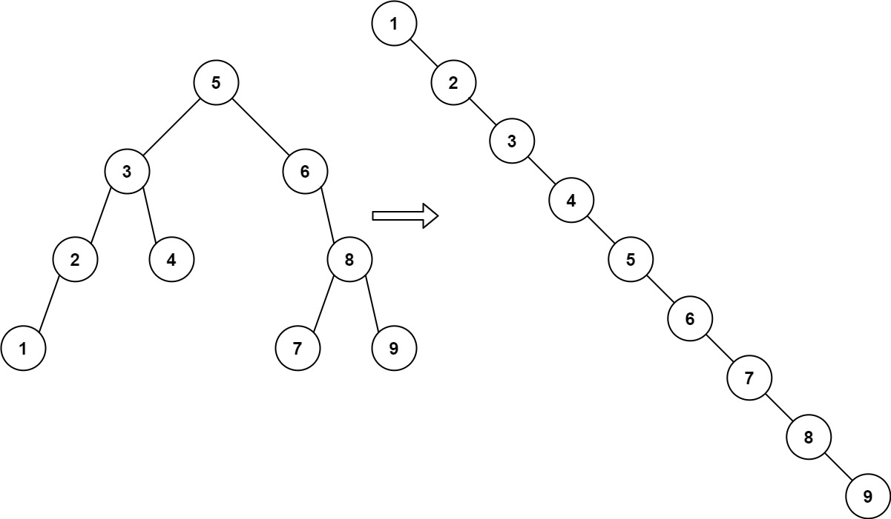

# 897. Increasing Order Search Tree

Given the `root` of a binary search tree, rearrange the tree in **in-order** so that the leftmost node in the tree is now the root of the tree, and every node has no left child and only one right child.

 

**Example 1:**



>**Input:** `root = [5,3,6,2,4,null,8,1,null,null,null,7,9]`  
**Output:** `[1,null,2,null,3,null,4,null,5,null,6,null,7,null,8,null,9]`  


**Example 2:**


>**Input:** `root = [5,1,7]`  
**Output:** `[1,null,5,null,7]`
 

**Constraints:**

* The number of nodes in the given tree will be in the range `[1, 100]`.
* `0 <= Node.val <= 1000`


## DFS + Inorder + Reconnect

```python
# Definition for a binary tree node.
# class TreeNode:
#     def __init__(self, val=0, left=None, right=None):
#         self.val = val
#         self.left = left
#         self.right = right
class Solution:
    def increasingBST(self, root: TreeNode) -> TreeNode:
        # inorder traverse get ordered values
        res = []
        def inorder(root):
            if not root:
                return
            inorder(root.left)
            res.append(root.val)
            inorder(root.right)

        inorder(root)
        # reconnect the right nodes
        cur = dummy = TreeNode()
        for i in range(len(res)):
            cur.right = TreeNode(val=res[i])
            cur = cur.right
        return dummy.right
```

## DFS + Inorder + Pointer

Change the right pointer during inorder traverse.

```python
# Definition for a binary tree node.
# class TreeNode:
#     def __init__(self, val=0, left=None, right=None):
#         self.val = val
#         self.left = left
#         self.right = right
class Solution:
    def __init__(self):
        # cur as the moving pointer for current node
        self.cur = None

    def increasingBST(self, root: TreeNode) -> TreeNode:
        # inorder with pointer changing
        def inorder(root):
            if not root:
                return 
            inorder(root.left)

            # change the pointer during inorder process
            # current node is always sorted
            self.cur.right = root
            # disconnect left child
            root.left = None
            # move current pointer to the root and keep going
            self.cur = root

            inorder(root.right)
        # dummy head for reconnect the whole tree
        dummy = TreeNode(-1)
        # current pointer points to dummy and start to traverse
        self.cur = dummy
        inorder(root)
        return dummy.right
```
