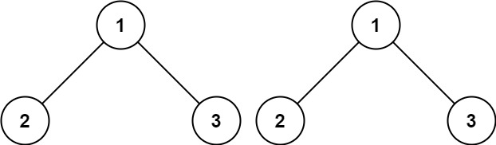
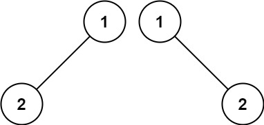
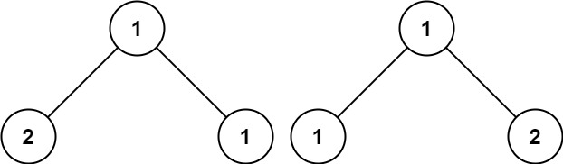

# 100. SameTree

Given the roots of two binary trees `p` and `q`, write a function to check if they are the same or not.

Two binary trees are considered the same if they are structurally identical, and the nodes have the same value.


**Example 1:**



**Input**: p = [1,2,3], q = [1,2,3]  
**Output**: true  


**Example 2:**




>**Input**: p = [1,2], q = [1,null,2]  
**Output**: false

**Example 3:**



>**Input**: p = [1,2,1], q = [1,1,2]  
**Output**: false
 

**Constraints:**

* The number of nodes in both trees is in the range `[0, 100]`.
* `-104 <= Node.val <= 104`

## ## Recursion Unfold: Iterative Approach, PreOrder Traversal

```python
# Definition for a binary tree node.
# class TreeNode:
#     def __init__(self, val=0, left=None, right=None):
#         self.val = val
#         self.left = left
#         self.right = right
class SolutionStack:
    """stack pre-order traverse"""
    def isSameTree(self, p: Optional[TreeNode], q: Optional[TreeNode]) -> bool:
        # add all nodes including None into the stack during iteration
        stack = [(p, q)]
        while stack:
            curp, curq = stack.pop()
            # both None, no more children, just keep popping
            if not curp and not curq:
                continue
            # different structure
            if not curp or not curq:
                return False
            # same structure, different value
            if curp.val != curq.val:
                return False
            # else they are both not None and got the same value
            stack.append((curp.right, curq.right))
            stack.append((curp.left, curq.left))
        return True
```

## Recursion

```python
# Definition for a binary tree node.
# class TreeNode:
#     def __init__(self, val=0, left=None, right=None):
#         self.val = val
#         self.left = left
#         self.right = right
class SolutionRecursion:
    """recursion"""
    def isSameTree(self, p: Optional[TreeNode], q: Optional[TreeNode]) -> bool:
        # termination condition
        # both nodes are None, they reach the end without return False, meaning they are the same
        if not p and not q:
            return True
        # different structure
        if not p or not q:
            return False
        # same structure but different values
        if p.val != q.val:
            return False
        # else they are not None with same values, going deeper on both sides
        return self.isSameTree(p.left, q.left) and self.isSameTree(p.right, q.right)
```


## Recursion Unfold: Iterative Approach, Level Traversal

```python
# Definition for a binary tree node.
# class TreeNode:
#     def __init__(self, val=0, left=None, right=None):
#         self.val = val
#         self.left = left
#         self.right = right
class Solution:
    def isSameTree(self, p: Optional[TreeNode], q: Optional[TreeNode]) -> bool:
        dq = collections.deque([(p, q),])
        while dq:
            p, q = dq.popleft()
            # both reached the end at the same time
            if not p and not q:
                continue
            # on reached the end, the other did not
            if not p or not q:
                return False
            # different values
            if p.val != q.val:
                return False
            # same value, keep going
            dq.append((p.left, q.left))
            dq.append((p.right, q.right))
        return True
```