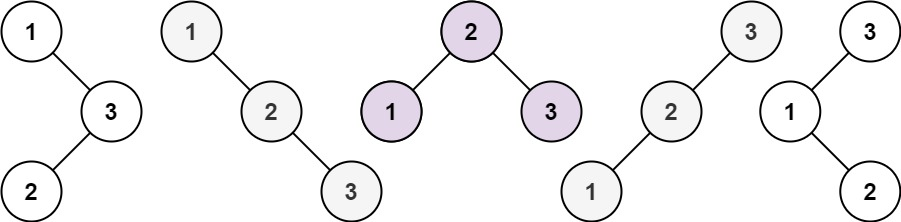

# 96. Unique Binary Search Trees


Given an integer `n`, return *the number of structurally unique **BST**'s (binary search trees) which has exactly `n` nodes of unique values from `1` to `n`*.


**Example 1:**




>**Input:** n = 3  
**Output:** 5


**Example 2:**

>**Input:** n = 1  
**Output:** 1

**Constraints:**

* `1 <= n <= 19`


## DP + BST
```python
class Solution:
    def numTrees(self, n: int) -> int:
        
        """
        # DP + BST
        dp[i] = number of unique BST given i nodes
        example: i = 5, given 5 nodes to construct BST

        # base case
        dp[0] = 1 No nodes, only one possibility
        dp[1] = 1 1 nodes, only one possibility
    
        take j as current root, j within [1, i]
        NodeNum    Current Root
        i = 2       j = 1, 2
        i = 3       j = 1, 2, 3
        i = 4       j = 1, 2, 3, 4
        i = 5       j = 1, 2, 3, 4, 5
        left_num = dp[j-1] exclude current root j, there's j-1 nodes on the left
        right_num = dp[i-j] exclude current root j, there's i-j nodes on the right
        # possibility if given i nodes to construct BST
        dp[i] += left_num * right_num     
         ROOT    LEFT      RIGHT
        dp[2] --> dp[2-1] * dp[5-2] 
        dp[3] --> dp[3-1] * dp[5-3]
        dp[4] --> dp[4-1] * dp[5-4]
        dp[5] --> dp[5-1] * dp[5-5]
        """
        dp = [0] * (n+1)
        dp[0] = 1
        dp[1] = 1
        for i in range(2, n + 1):
            # given i nodes, j is current root, start from 1 to i
            for j in range(1, i+1):
                # possibility of unique BST given nodes on the left
                left_num = dp[j-1]
                # possibility of unique BST given nodes on the right
                right_num = dp[i-j]
                # given i nodes, 
                # possibility of j as current root unique BST = possibility LEFT * possibility RIGHT
                # all possibility add together, from j = 1, j = 2 ... j = i
                dp[i] += left_num * right_num
        return dp[n]
```
