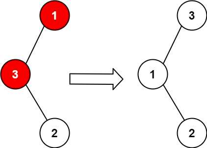
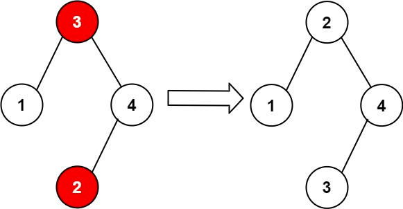

# 99. Recover Binary Search Tree

You are given the `root` of a binary search tree (BST), where the values of exactly two nodes of the tree were swapped by mistake. Recover *the tree without changing its structure*.

**Example 1:**



**Input**: root = [1,3,null,null,2]
**Output**: [3,1,null,null,2]
**Explanation**: 3 cannot be a left child of 1 because 3 > 1. Swapping 1 and 3 makes the BST valid.


**Example 2:**




**Input**: root = [3,1,4,null,null,2]
**Output**: [2,1,4,null,null,3]
**Explanation**: 2 cannot be in the right subtree of 3 because 2 < 3. Swapping 2 and 3 makes the BST valid.
 

**Constraints:**

* The number of nodes in the tree is in the range `[2, 1000]`.
* `-231 <= Node.val <= 231 - 1`
 

Follow up: A solution using `O(n)` space is pretty straight-forward. Could you devise a constant `O(1)` space solution?


## Iterative Inorder Traversal

```python
# Definition for a binary tree node.
# class TreeNode:
#     def __init__(self, val=0, left=None, right=None):
#         self.val = val
#         self.left = left
#         self.right = right
class Solution:
    def recoverTree(self, root: Optional[TreeNode]) -> None:
        """
        Do not return anything, modify root in-place instead.
        """
        # inorder traversal is sorted
        # stack
        stack = []
        x = y = prev = None

        while stack or root:
            while root:
                stack.append(root)
                # keep going left until None
                root = root.left
            # end of left, start to pop and handle current node
            root = stack.pop()
            # out of order node found
            if prev and root.val < prev.val:
                # keep updating x and y
                y = root
                if not x:
                    x = prev
                else:
                    break
            # inorder: current node should always be bigger than the previous node 
            prev = root
            # inorder traversal, left ... -> root -> right
            root = root.right
        
        # swap
        x.val, y.val = y.val, x.val
```


## Recursive Inorder Traversal(DFS)

```python
# Definition for a binary tree node.
# class TreeNode:
#     def __init__(self, val=0, left=None, right=None):
#         self.val = val
#         self.left = left
#         self.right = right
class Solution:

    def recoverTree(self, root: Optional[TreeNode]) -> None:
        """
        Do not return anything, modify root in-place instead.
        """
        # recursive inorder traversal
        def dfs(root):
            # KEY: used in nested functions, nonlocal indicates variable in closest(nearest one) outer scope
            nonlocal x, y, prev
            if not root:
                return
            
            # keep going left
            dfs(root.left)

            # return from left, current node out of order
            # store current root for later swap
            if prev and root.val < prev.val:
                y = root
                # KEY: if x is None, root is the first occurrence out of order
                if not x:
                    x = prev
                # KEY: if we get x, current root is the second occurrence out of order, we get both nodes, return and swap
                else:
                    return 

            # current node is the latest inorder node, update it as prev
            prev = root
            # go right
            dfs(root.right)
        
        x = y = prev = None
        dfs(root)
        x.val, y.val = y.val, x.val
```
