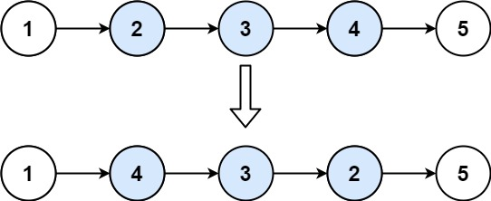

# 92. Reverse Linked List II

Given the `head` of a singly linked list and two integers `left` and `right` where `left <= right`, reverse the nodes of the list from position `left` to position `right`, and return the *reversed list*.

 

**Example 1:**


```
Input: head = [1,2,3,4,5], left = 2, right = 4
Output: [1,4,3,2,5]
```
**Example 2:**
```
Input: head = [5], left = 1, right = 1
Output: [5]
```

**Constraints:**

The number of nodes in the list is n.
1 <= n <= 500
-500 <= Node.val <= 500
1 <= left <= right <= n
 

**Follow up:** Could you do it in **one pass**?


## Tow Pointers
```python
# Definition for singly-linked list.
# class ListNode:
#     def __init__(self, val=0, next=None):
#         self.val = val
#         self.next = next
class Solution:
    def reverseBetween(self, head: Optional[ListNode], left: int, right: int) -> Optional[ListNode]:
        """two pointers"""
        if not head or left == right:
            return head
        dummy = ListNode(0, head)
        prev = dummy
        # prev reaches the node before left after left - 1 steps
        for _ in range(left - 1):
            prev = prev.next
        # reverse start from current node
        cur = prev.next
        # reverse ends after right - left steps
        for _ in range(right - left):
            nxt = cur.next
            # cur jump
            cur.next = nxt.next
            # KEY step: move nxt between pre and pre.next, draw to see
            nxt.next = prev.next    
            prev.next = nxt
        return dummy.next
```


## Stack
```python
# Definition for singly-linked list.
# class ListNode:
#     def __init__(self, val=0, next=None):
#         self.val = val
#         self.next = next
class Solution:
    def reverseBetween(self, head: Optional[ListNode], left: int, right: int) -> Optional[ListNode]:
        # three ways to solve: two pointers, recursion, stack.
        if not head or left == right:
            return head
        dummy = ListNode(0, head)
        prev = dummy
        # prev reaches the node before left after left - 1 steps
        for _ in range(left - 1):
            prev = prev.next
        # put all nodes needed to be reversed into stack
        stack = []
        # reverse start from current node
        cur = prev.next
        # there are (right - left + 1) nodes needed to be reversed
        for _ in range(right - left + 1):
            stack.append(cur)
            cur = cur.next
        # pop out is reversed, keep reconnecting
        while stack:
            # KEY: reverse is about putting last node after prev 
            prev.next = stack.pop()
            prev = prev.next
        # reconnect the prev
        prev.next = cur
        return dummy.next
```

TODO: recursion.
