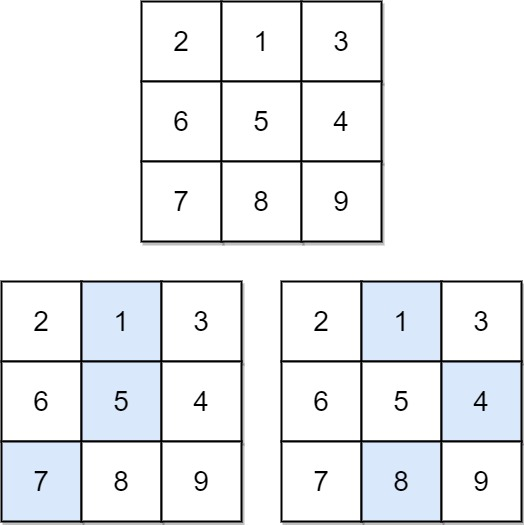
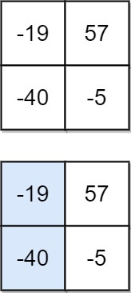

# 931. Minimum Falling Path Sum

Given an `n x n` array of integers `matrix`, return *the **minimum sum** of any **falling path** through `matrix`.*

A **falling path** starts at any element in the first row and chooses the element in the next row that is either directly below or diagonally left/right. Specifically, the next element from position `(row, col)` will be `(row + 1, col - 1)`, `(row + 1, col)`, or `(row + 1, col + 1)`.


**Example 1:**


>Input: matrix = [[2,1,3],[6,5,4],[7,8,9]]  
Output: 13  
Explanation: There are two falling paths with a minimum sum as shown.  

**Example 2:**


>Input: matrix = [[-19,57],[-40,-5]]  
Output: -59  
Explanation: The falling path with a minimum sum is shown.  
 

**Constraints:**

* `n == matrix.length == matrix[i].length`
* `1 <= n <= 100`
* `-100 <= matrix[i][j] <= 100`


## DP Top Down: Recursion + Memoization

```python
class Solution:
    def minFallingPathSum(self, matrix: List[List[int]]) -> int:        
        # DP Top Down: Recursion + Memoization
        
        def dfs(x, y):
            # out of boundry
            if x < 0 or x >= len(matrix) or y < 0 or y >= len(matrix[0]):
                return float("inf")     # return MAX_INT, never be chosen
            # KEY: reach the last row, return current cell num
            if x == len(matrix) - 1:
                return matrix[x][y]     
            # cache found, return directly, WARN: 0 or 1 or None cause TLE, change to sth out of bound
            if memo[x][y] != 101:
                return memo[x][y]

            # find the MIN num in 3 branches below
            curr_min = min(dfs(x+1, y-1), dfs(x+1, y), dfs(x+1, y+1))
            # KEY: addition bottom up, below min + current cell
            memo[x][y] = curr_min + matrix[x][y]
            return memo[x][y]
            
        res = float('inf')
        nrow, ncol = len(matrix), len(matrix[0])
        # Status: memo[x][y] -> min path sum at x, y
        memo = [[101 for _ in range(ncol)] for _ in range(nrow)]

        # go through all cells of first row
        for c in range(ncol):
            res = min(res, dfs(0, c))
        return res
```


## DP Bottom Up: Tabulation
```python
class Solution:
    def minFallingPathSum(self, matrix: List[List[int]]) -> int:
        # DP Bottom Up: Tabulation
        # status: min_path_sum at cell row, col
        # recursive relation: current min path sum = min(left, mid, right) + current num
        nrow, ncol = len(matrix), len(matrix[0])

        # KEY: add one more row for the bottom min_path_sum, add one more col to avoid index out of bound
        dp = [[0 for _ in range(ncol + 1)] for _ in range(nrow + 1)]

        for r in range(nrow-1, -1, -1):
            for c in range(ncol):
                # edge case, col = 0, col = ncol-1
                if c == 0:
                    print(r, c)
                    dp[r][c] = min(dp[r+1][c], dp[r+1][c+1]) + matrix[r][c]
                elif c == ncol - 1:
                    dp[r][c] = min(dp[r+1][c-1], dp[r+1][c]) + matrix[r][c]
                else:
                    dp[r][c] = min(dp[r+1][c-1], dp[r+1][c], dp[r+1][c+1]) + matrix[r][c]
        
        # traverse the first row to find the smallest as the result
        return min([dp[0][c] for c in range(ncol)])
```
