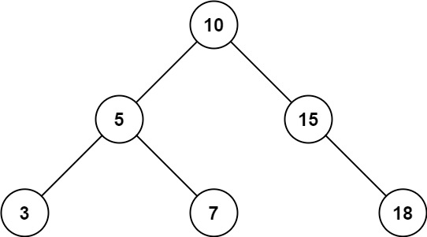
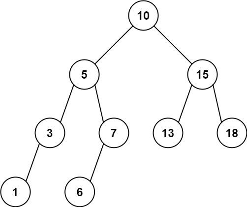

# 938. Range Sum of BST


Given the `root` node of a binary search tree and two integers `low` and `high`, return *the sum of values of all nodes with a value in the **inclusive** range `[low, high]`*.

**Example 1:**



>**Input:** `root = [10,5,15,3,7,null,18], low = 7, high = 15`  
**Output:** `32`  
**Explanation:** `Nodes 7, 10, and 15 are in the range [7, 15]. 7 + 10 + 15 = 32.`


**Example 2:**



>**Input:** `root = [10,5,15,3,7,13,18,1,null,6], low = 6, high = 10`  
**Output:** `23`  
**Explanation:** `Nodes 6, 7, and 10 are in the range [6, 10]. 6 + 7 + 10 = 23.`
 

**Constraints:**

* The number of nodes in the tree is in the range `[1, 2 * 104]`.
* `1 <= Node.val <= 105`
* `1 <= low <= high <= 105`
* All `Node.val` are **unique**.


## Recursion V1
```python
# Definition for a binary tree node.
# class TreeNode:
#     def __init__(self, val=0, left=None, right=None):
#         self.val = val
#         self.left = left
#         self.right = right
class Solution:
    def rangeSumBST(self, root: Optional[TreeNode], low: int, high: int) -> int:
        """DFS, BST definition, recursion version 1"""
        if not root: return 0
        total = 0
        # keep going LEFT until value <= low, no more matches to find
        if root.val > low:
            total += self.rangeSumBST(root.left, low, high)
        # keep going RIGHT until value >= high, no more matches to find
        if root.val < high:
            total += self.rangeSumBST(root.right, low, high)
        # in the range, add value to total
        if low <= root.val <= high:
            # add current value
            total += root.val
        # return total of current recursion for adding it up together
        return total
```


## Recursion V2
```python
class Solution:
    def rangeSumBST(self, root: Optional[TreeNode], low: int, high: int) -> int:
        if not root:
            return 0
        return self.rangeSumBST(root.left, low, high) + \
                self.rangeSumBST(root.right, low, high) + \
                (root.val if low <= root.val <= high else 0)
```


## Iteration + Stack

```python
class Solution:
    def rangeSumBST(self, root: Optional[TreeNode], low: int, high: int) -> int:
        """Iteration, Stack"""
        stack = [root]
        total = 0
        while stack:
            cur = stack.pop()
            if not cur: continue
            # LEFT child is possible node, push it into stack
            if cur.val > low: stack.append(cur.left)
            # RIGHT child is possible node, push it into stack
            if cur.val < high: stack.append(cur.right)
            # current node is in the range
            if cur.val >= low and cur.val <= high:
                total += cur.val
        return total
```
