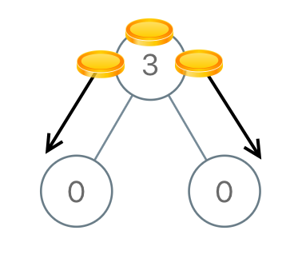
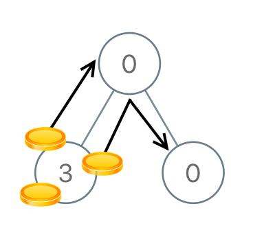

# 979. Distribute Coins in Binary Tree

You are given the `root` of a binary tree with `n` nodes where each `node` in the tree has `node.val` coins. There are `n` coins in total throughout the whole tree.

In one move, we may choose two adjacent nodes and move one coin from one node to another. A move may be from parent to child, or from child to parent.

Return the **minimum** number of moves required to make every node have exactly one coin.

 

**Example 1:**



>Input: root = [3,0,0]  
Output: 2  
Explanation: From the root of the tree, we move one coin to its left child, and one coin to its right child.  


**Example 2:**



>Input: root = [0,3,0]  
Output: 3  
Explanation: From the left child of the root, we move two coins to the root [taking two moves]. Then, we move one coin from the root of the tree to the right child.  
 

**Constraints:**

* The number of nodes in the tree is `n`.
* `1 <= n <= 100`
* `0 <= Node.val <= n`
* The sum of all `Node.val` is `n`.


## DFS Post Order(EXCHANGE)

1. Minimum: start from leaves(post order) to ensure one direction **EXCHANGE**, so it will be minimum
2. **positive/negative**: num of coins the child giving(lending)/taking(borrowing) to curr
3. **EXCHANGE**: abs(left) + abs(right)
4. left + right: the total coins the children will EXCHANGE up with curr
5. node.val - 1: the total coins curr itself can EXCHANGE up
6. total num of coins this whole subtree will pass up: (node.val - 1) + left + right


```python
# Definition for a binary tree node.
# class TreeNode:
#     def __init__(self, val=0, left=None, right=None):
#         self.val = val
#         self.left = left
#         self.right = right
class Solution:

    def __init__(self):
        self.moves = 0

    def distributeCoins(self, root: Optional[TreeNode]) -> int:
        # KEY: DFS Post Order: start from leaves to ensure one direction EXCHANGE

        def postOrder(node):
            # Base Case: no EXCHANGE happens
            if not node:
                return 0
            # positive: num of coins the child giving(lending) to curr
            # negative: num of coins the child taking(borrowing) to curr
            left = postOrder(node.left)
            right = postOrder(node.right)

            # KEY: FORGET giving or taking, ONLY number of EXCHANGE
            # it cost same num of EXCHANGE, no matter how many coins we're taking or giving
            self.moves += abs(left) + abs(right)

            # left + right: the total coins the children will EXCHANGE up with curr
            # node.val - 1: the total coins curr itself can EXCHANGE up
            # the total num of coins this subtree will EXCHANGE up
            return (node.val - 1) + left + right

        postOrder(root)
        return self.moves
```
