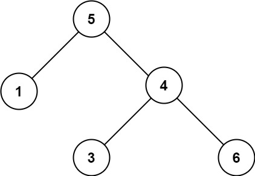

# 98. Validate Binary Search Tree

Given the `root` of a binary tree, *determine if it is a valid binary search tree (BST)*.

A **valid BST** is defined as follows:

* The left subtree of a node contains only nodes with keys **less than** the node's key.
* The right subtree of a node contains only nodes with keys **greater than** the node's key.
* Both the left and right subtrees must also be binary search trees.
 

**Example 1:**


```
Input: root = [2,1,3]
Output: true
```

**Example 2:**



```
Input: root = [5,1,4,null,null,3,6]
Output: false
Explanation: The root node's value is 5 but its right child's value is 4.
```

**Constraints:**

* The number of nodes in the tree is in the range `[1, 104]`.
* `-231 <= Node.val <= 231 - 1`

## Recursion(DFS)
```python
# Definition for a binary tree node.
# class TreeNode:
#     def __init__(self, val=0, left=None, right=None):
#         self.val = val
#         self.left = left
#         self.right = right
class Solution:
    def isValidBST(self, root: Optional[TreeNode]) -> bool:
        """DFS, recursion, help method, check (lower, upper) boundary"""
        def boundary(root, lower=float('-inf'), upper=float('inf')):
            # successfully reach the end, no violation of rules
            if not root: return True
            # value should be within (lower, upper)
            # violation:
            # value of left subtree >= upper bound
            # value of right subtree <= lower bound
            if root.val >= upper or root.val <= lower:
                return False
            # update upper bound to smaller value, check left < upper
            # update lower bound to larger value, check right > lower
            return boundary(root.left, lower, root.val) and boundary(root.right, root.val, upper) 
        return boundary(root)
```

## Stack(Inorder Traversal)
```python
# Definition for a binary tree node.
# class TreeNode:
#     def __init__(self, val=0, left=None, right=None):
#         self.val = val
#         self.left = left
#         self.right = right
class Solution:
    def isValidBST(self, root: Optional[TreeNode]) -> bool:
        """inorder traversal with stack, LEFT -> CUR -> RIGHT"""
        cur, max_, stack = root, float('-inf'), list()
        while cur or stack:
            # reach the end, process current node
            if not cur:
                # pop a new node from stack
                cur = stack.pop()
                # result of BST preorder is ordered, new value should always be bigger
                if cur.val <= max_:
                    return False
                # update max value
                max_ = cur.val
                # CUR -> RIGHT
                cur = cur.right
            # keep adding LEFT into stack
            else:
                stack.append(cur)
                cur = cur.left
        # cur.val > max_ is always true
        return True
```
